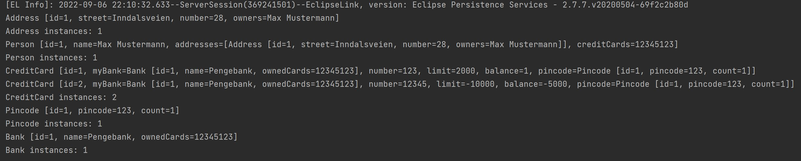

# DAT 250 Expass 2

## Technical problems with JPA installation
I had no technical problems with the JPA installation

## Link to code for experiment 2
[Link to code for experiment 2](https://github.com/wuw012/dat250-experiment2).

## Database

*Database Output*

## Pending issues
I had some issues with the tests where it failed on `line 75` and `line 49` in MainTest.java. 
I think this issue is because I changed from Set<> to List<>. 
Everything else works so hopefully that is okay :)
